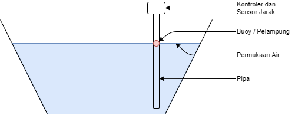

# Sistem Pengamat Ketinggian Air Sungai
Sistem ini dibuat untuk mengamati ketinggian muka air sungai di daerah-daerah. Informasi lebih lanjut silahkan lihat di [wiki](./wiki).

Secara umum, sistem pengambilan dan pemantauan data ketinggian permukaan air sungai ini dapat dibagi menjadi beberapa sub-sistem, yakni

## 🖥 Perangkat Keras

### 🌊 Sistem deteksi ketinggian permukaan air sungai
sensor jarak akan digunakan untuk mengukur jarak antara pelampung dengan sensor jarak.

***Gambar 1.** Pengukuran ketinggian permukaan air sungai dengan sensor jarak*

[dalam tahap pengembangan]

### 🔋 Sistem catu daya
Sistem catu daya yang diusulkan pada alat ini adalah dengan menggunakan panel surya berukuran kecil, sistem manajemen baterai, serta baterai lithium-ion.

[dalam tahap pengembangan]

### 📶 Sistem transmisi data 

[dalam tahap pengembangan]

## 🖥 Perangkat Lunak

### 💾 Database
Database digunakan untuk menyimpan data hasil pengukuran oleh sensor. Database yang digunakan adalah database MongoJS yang berbasis NoSQL. 

dokumentasi Database dapat dilihat [di sini](wiki/Database.md).

### 📝 Akuisisi data
Akuisisi data dapat dilakukan dengan menggunakan server dan API. Data hasil akuisisi akan disimpan di server secara *realtime* sehingga tidak akan hilang meskipun terdapat kerusakan pada alat.

dokumentasi API dapat dilihat [di sini](wiki/API.md).

### 📊 Visualisasi data
Data yang telah diakuisisi oleh server dapat divisualisasikan dalam bentuk grafik serta dapat diunduh untuk dianalisis.

